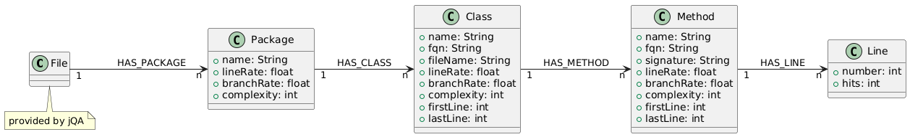

# jQAssistant Cobertura Scanner Plugin

This is a plugin for jQAssistant that scans Cobertura Coverage Reports. This plugin was originally developed for coverage reports output by the dotnet test ecosystem, as the output format can be specified to be cobertura. This plugin however works just fine with any cobertura report.

If you find any bugs or have any feature requests, feel free to open issues or contribute.

## How to install
Use the jqassistant.yml as described [in the jQAssistant User Manual](https://jqassistant.github.io/jqassistant/current/#_yaml_files) and add the following three lines in  the plugins section:

```
    - group-id: de.kontext_e.jqassistant.plugin
      artifact-id: jqassistant.plugin.cobertura
      version: 0.1.0
```

This plugin was only tested with jQAssistant 2.1 and higher.

## Usage

This Plugin scans files which are contained in a directory called "TestResults" or it's subdirectories, if the file is a xml file. Additionally, all files called "coverage.cobertura.xml" are scanned by default regardless of their containing directory.
You can modify this behaviour by setting the `jqassistant.plugin.cobertura.filename`-property and the `jqassistant.plugin.cobertura.dirname`-property respectively. Setting properties is explained [in the jQAssistant User Manual](https://jqassistant.github.io/jqassistant/current/#_yaml_files). The Values of the properties are printed at the start of the scan process so you can double-check if the properties were set correctly.

If you have multiple coverage files, it is recommended, that you merge them before the scan using a tool such as `dotnet-coverage` as otherwise the branchCoverage of packages, classes and methods are likely wrong. The tool works for any arbitrary cobertura report. For more details see the Known Issues section

## Known Issues 

 - Plugin can only scan well-formed cobertura coverage reports. In some pipelines the individual reports are not properly merged, resulting in malformed xml files.
 - When this plugin scans multiple individual test reports, they are merged during scanning. This merging is a Work-in-Progress and only implemented for line coverage as of now. If the correct branch coverage is desired, then the individual test reports should be merged beforehand. A tool that does this and does not produce a malformed xml file is [dotnet-coverage](https://learn.microsoft.com/en-us/dotnet/core/additional-tools/dotnet-coverage#dotnet-coverage-merge). Although this tool ins called 'dotnet' it works with any cobertura coverage report. Note that this tool requires the ``-f cobertura`` flag to output a cobertura file.

## Data Structure

